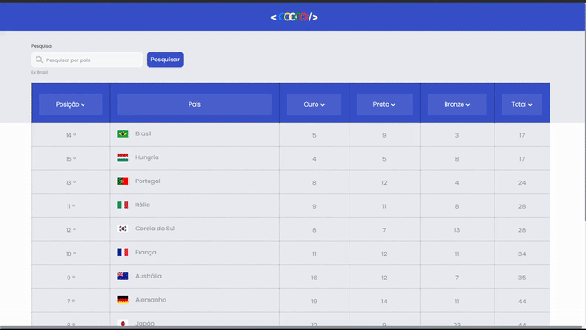

<!-- PROJECT LOGO -->
 

<h1 align="center">Quadro de medalhas das olímpiadas </h1>

  

    É uma aplicação que renderiza os dados de uma API de medalhas das olímpiadas em uma tabela estilizada, contendo botões para ordenações e um campo de pesquisa.
     
    <a href="https://guiwustro.github.io/quadro-de-medalhas-olimpiadas/">Link do projeto</a>

  

## Sobre o projeto

<!--  -->

A página apresenta um quadro de medalhas, cujo o banco de dados foi retirado
dessa API. Há um campo de pesquisa para pesquisar pelo nome do país, e é
possível fazer filtros clicando nos botões da tabela, ordenando pelo total de
medalhas, pelas medalhas de bronze, prata ou ouro, e também pela sua posição no
ranking.

## Tecnologias utilizadas

O projeto foi realizado utilizando JavaScript Vanilla, utilizando classes para
melhor organização, CSS e HTML.   A base de estilização utilizada para fazer
o projeto foi esse
<a href="https://www.figma.com/file/9ck8OxFkUTtx2DBtzffO4L/M2---Sprint1---Olimp%C3%ADadas-HTML---CSS---JS?node-id=0:1">Figma</a>.

## Usabilidade

## Features

- [x] Utilização de uma
      <a href="https://kenzie-olympics.herokuapp.com/paises">API</a> para gerar
      a lista de medalhas;
- [x] Ordenação pela quantidade de melhas de ouro, prata, bronze e total de
      medalhas;
- [x] Campo de busca para pesquisa dos países;
- [x] Ordenação pela posição do país no ranking;
